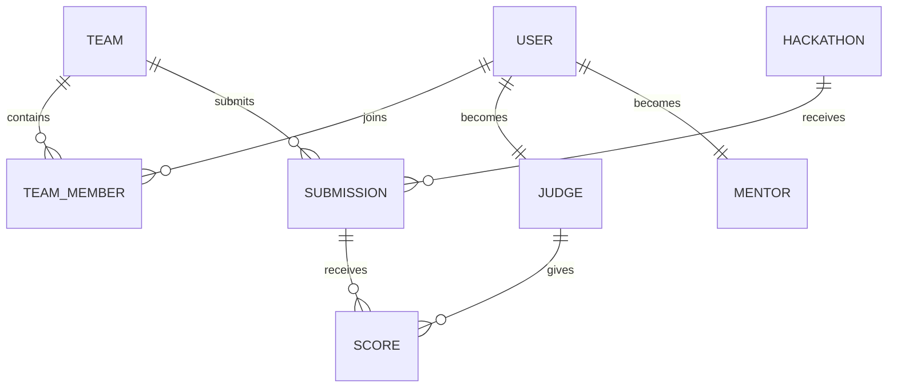

# Entity Relationship Diagram (ERD)

## Purpose

This document describes the database structure of the SEAL Hackathon Management System.

## Entities

### User

* user_id (PK)
* username
* email
* password_hash
* role

### Team

* team_id (PK)
* team_name
* leader_id (FK)
* created_at

### TeamMember

* team_member_id (PK)
* team_id (FK)
* user_id (FK)

### Hackathon

* hackathon_id (PK)
* title
* description
* start_date
* end_date

### Submission

* submission_id (PK)
* team_id (FK)
* hackathon_id (FK)
* project_name
* github_link
* submitted_at

### Judge

* judge_id (PK)
* user_id (FK)

### Mentor

* mentor_id (PK)
* user_id (FK)

### Score

* score_id (PK)
* submission_id (FK)
* judge_id (FK)
* score
* feedback

## Relationships

* One User can join multiple Teams through TeamMember.
* One Team contains multiple members.
* One Team can submit multiple projects.
* One Hackathon receives multiple submissions.
* One Judge can evaluate multiple submissions.
* One Submission can receive multiple scores.
* One Mentor can support multiple teams.

## ERD Diagram

