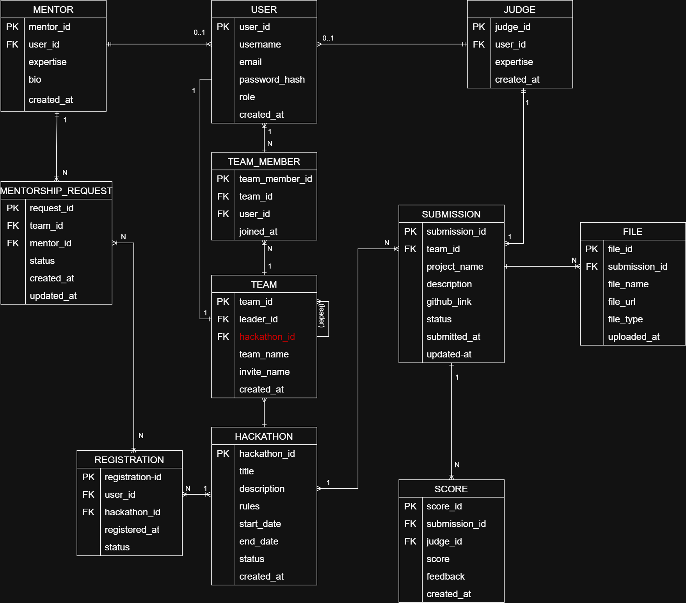

# Entity Relationship Diagram (ERD)

## SEAL Hackathon Management System

### ERD Diagram

### Description

The ERD describes the database structure of the SEAL Hackathon Management System, including:

- User
- Team
- Team Member
- Hackathon
- Registration
- Submission
- Score
- Judge
- Mentor
- Mentorship Request
- File
